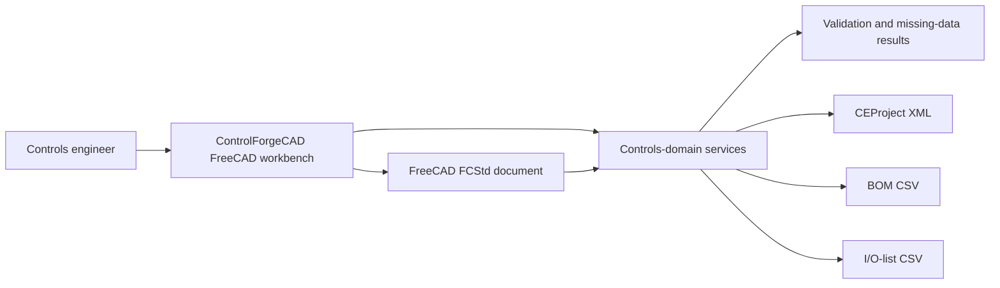
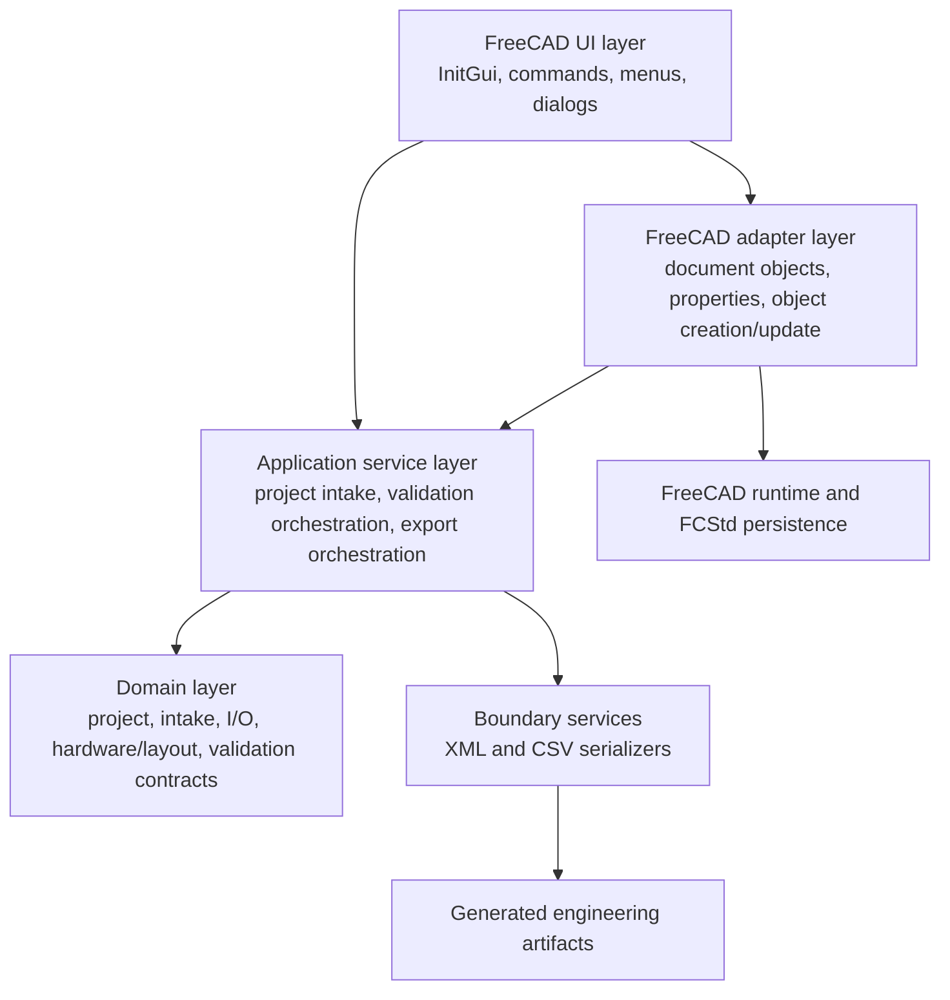
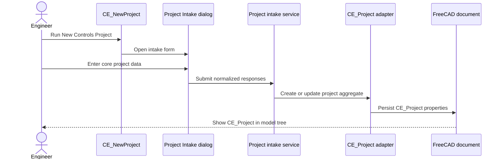
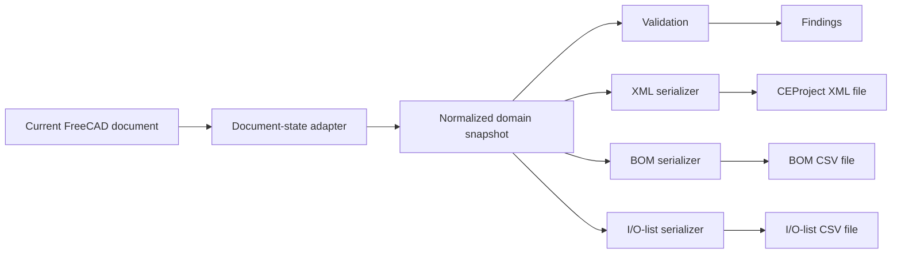

# integraCAD Open Architecture

## 1. Purpose and scope

This document is the architectural source of truth for **integraCAD Open**. The project provides controls-engineering data, validation, layout, and documentation workflows. **ControlForgeCAD** is the current FreeCAD workbench implementation contained in `ControlForgeCAD/`.

The architecture is intentionally layered so controls-domain behavior can be tested independently of the FreeCAD GUI and extended without embedding business rules in toolbar commands or dialogs.

## 2. System context

integraCAD Open currently supports an engineer who needs to:

1. collect initial controls-project information;
2. persist that information in a FreeCAD document;
3. identify missing or incomplete engineering data;
4. create starter control-panel layout objects;
5. validate project and layout metadata; and
6. export starter CEProject XML, BOM CSV, and I/O-list CSV artifacts.



## 3. Project identity and naming

- **integraCAD Open** is the overall open-source controls-engineering CAD project.
- **ControlForgeCAD** is the current FreeCAD workbench and integration module.
- `CE_Project` is the principal FreeCAD document object representing project-level controls data.
- Commands use the `CE_` prefix to identify controls-engineering workbench actions.

Historical references to IntegraCAB should be treated as legacy naming unless they refer to an existing output filename or compatibility behavior. New project-facing documentation and design work should use **integraCAD Open**.

## 4. Architectural principles

### 4.1 FreeCAD is an adapter, not the domain model

FreeCAD commands, dialogs, and document properties adapt user actions and persisted `.FCStd` state into controls-domain inputs. Domain rules should remain callable from pure Python wherever practical.

### 4.2 One authoritative project state

The active FreeCAD document and its `CE_Project` properties are the authoritative interactive project state. Export and validation services must read current object values rather than stale dialog values or module-level caches.

### 4.3 Deterministic outputs

Given the same project state, XML, BOM, I/O-list, validation, and missing-data outputs should be stable in field selection, ordering, and serialization.

### 4.4 Explicit implementation status

Documentation distinguishes:

- **Implemented** — present and usable in the current workbench;
- **Partial** — implemented as a starter contract or placeholder model;
- **Planned** — architectural direction without a complete implementation.

### 4.5 Dependency direction

Higher-level user-interface code may depend on application and domain services. Domain modules must not depend on GUI widgets. Exporters may depend on domain contracts but should not own project-state mutation.

## 5. Layered architecture



### 5.1 FreeCAD UI layer

**Responsibilities**

- register the Controls / Automation workbench;
- expose commands through menus and toolbars;
- open the Project Intake dialog;
- obtain the active FreeCAD document and selected objects;
- present validation, missing-data, and export results;
- provide safe behavior when optional GUI facilities are unavailable.

**Implemented commands**

- `CE_NewProject`
- `CE_CreatePanel`
- `CE_ValidateProject`
- `CE_PreviewMissingData`
- `CE_ExportBOM`
- `CE_ExportCEProjectXML`
- `CE_ExportIOList`

**Boundary rule:** command activation methods should coordinate work, not define validation rules, output schemas, or equipment-selection logic.

### 5.2 FreeCAD adapter and document-object layer

**Responsibilities**

- create or locate the `CE_Project` document object;
- define editable project and intake properties;
- synchronize FreeCAD properties with backend input contracts;
- preserve properties through `.FCStd` save and reload;
- create starter physical-layout objects with BOM-relevant metadata;
- translate FreeCAD object state into domain records.

The `CE_Project` object currently exposes project and intake fields such as project name, customer, site/location, deliverables, PLC platform, voltage, phase count, enclosure rating, and sensor count.

Starter layout objects currently include:

- panel/backplate;
- DIN rail;
- wire duct;
- terminal strip;
- PLC rack; and
- PLC module.

These layout objects are **partial engineering models**. They establish object identity and metadata contracts but do not yet constitute a complete electrical-panel design or automated placement engine.

### 5.3 Application service layer

**Responsibilities**

- convert current document properties into project-intake inputs;
- orchestrate validation and missing-data evaluation;
- build starter I/O-list records;
- collect BOM-eligible layout objects;
- invoke serializers and select output destinations;
- return structured results suitable for GUI or test use.

Application services define use cases. They should not depend on a particular dialog layout, toolbar arrangement, or FreeCAD selection mechanism.

### 5.4 Domain layer

The domain layer represents controls-engineering concepts independently of presentation and persistence details.

Current or starter contracts cover:

- project identity and site/customer context;
- intake questions, responses, and source records;
- deliverables and platform selections;
- electrical characteristics;
- I/O demand and starter I/O-list records;
- physical-layout and BOM metadata;
- validation findings and missing-data payloads.

Domain validation should return structured findings rather than directly displaying message boxes.

### 5.5 Boundary and serialization services

Boundary services transform domain state into external engineering artifacts.

#### CEProject XML

**Implemented, starter scope.** The XML export serializes the current CEProject/intake state to `~/integracab_ceproject.xml` by default. The export contract should remain versionable and separate from FreeCAD property names so schema evolution does not require GUI redesign.

Planned evolution includes richer contacts, source records, validation findings, hardware references, and standards-aligned interchange mappings.

#### BOM CSV

**Implemented, starter scope.** BOM export collects supported layout objects with assigned manufacturer, part number, description, and related metadata and writes `~/controlforgecad_bom.csv` by default.

The current BOM is not a complete procurement or ERP integration. Future work may add quantity aggregation, vendor normalization, lifecycle status, alternates, pricing interfaces, and manufacturer-catalog adapters.

#### I/O-list CSV

**Implemented, starter scope.** The I/O-list service creates deterministic starter records from current intake data and writes `~/integracab_io_list.csv` by default.

Future work may add channel allocation, rack/slot addressing, signal typing, terminal mapping, device associations, safety classification, and vendor-specific import/export formats.

## 6. Principal object contracts

### 6.1 `CE_Project`

`CE_Project` is the interactive project aggregate stored in the FreeCAD document.

**Contract expectations**

- one authoritative project object per controls project document;
- deterministic creation and update behavior;
- editable properties grouped for usable Property View navigation;
- values retained through save/reopen;
- validation and exports read current properties;
- missing values remain distinguishable from valid zero or false values.

### 6.2 Layout objects

Layout objects represent physical or logical panel components in the FreeCAD model tree.

**Contract expectations**

- stable object type or role identification;
- human-readable label;
- BOM metadata where applicable;
- parent/containment relationship where supported;
- geometry may be placeholder geometry during starter phases;
- exporters must ignore unsupported objects rather than infer unreliable part data.

### 6.3 Validation finding

A validation finding should identify:

- rule or field identifier;
- severity or status;
- affected object or data path;
- concise message;
- observed value when useful; and
- remediation guidance when deterministic.

The current missing-data workflow uses paths such as `io.sensorCount` to keep findings traceable to domain fields rather than dialog coordinates.

## 7. Project and data flows

### 7.1 New project flow



### 7.2 Validation and missing-data flow

1. The command resolves the active `CE_Project`.
2. The adapter reads current FreeCAD properties.
3. Application services normalize values into domain inputs.
4. Validation and missing-data rules evaluate those inputs.
5. Structured findings are returned.
6. The GUI presents the result without changing domain semantics.

### 7.3 Starter panel flow

1. `CE_CreatePanel` resolves the active document and project context.
2. Starter layout objects are created using deterministic roles and labels.
3. Objects receive available BOM metadata.
4. Validation can inspect project and layout metadata.
5. BOM export selects supported objects with sufficiently populated fields.

### 7.4 Export flow



Exports should operate on a normalized snapshot so a single export cannot observe internally inconsistent values while the document is being mutated.

## 8. Dependency boundaries

### Allowed dependencies

- GUI commands → adapters and application services
- dialogs → input contracts and application services
- adapters → domain contracts and FreeCAD APIs
- application services → domain logic and serializers
- serializers → domain snapshots and standard-library I/O
- tests → any public contract under test

### Prohibited or discouraged dependencies

- domain modules → FreeCAD GUI or PySide widgets;
- serializers → active-document global state;
- validation rules → message boxes;
- commands → hard-coded schema serialization;
- vendor-specific catalog logic → core project objects without an adapter boundary;
- tests of pure domain behavior → required FreeCAD GUI startup.

Optional integrations must fail safely and must not prevent the base workbench from loading.

## 9. Extension strategy

### 9.1 New command

A new command should contain registration metadata, activation/precondition logic, and orchestration only. Reusable behavior belongs in an application or domain service. GUI behavior requires documented manual validation.

### 9.2 New project field

Adding a project field normally requires coordinated changes to:

1. the domain/intake contract;
2. the `CE_Project` property specification and adapter;
3. normalization and missing-value handling;
4. validation rules;
5. affected serializers;
6. automated tests; and
7. user and architecture documentation.

### 9.3 New export format

A new exporter should accept a normalized domain snapshot, produce deterministic output, avoid mutating the document, and have pure-Python tests. FreeCAD-specific file dialogs should remain in the GUI layer.

### 9.4 Vendor catalog integration

Vendor integrations are **planned**. Each integration should be implemented as an adapter that maps manufacturer data into neutral hardware contracts. Core services should not require Siemens, Rockwell Automation, or another vendor's identifiers to function.

### 9.5 XML schema evolution

Schema changes should be versioned and migration-aware. FreeCAD property names, Python attribute names, and XML element names may map to each other but should not be assumed identical contracts.

## 10. Testing and verification architecture

### Automated validation

Run from the repository root:

```bash
python3 -m pytest
python3 -m compileall ControlForgeCAD
```

Automated tests should prioritize:

- pure domain validation;
- deterministic serialization;
- project property specifications;
- object creation/update behavior;
- command registration and import safety;
- fallback behavior when FreeCAD or GUI modules are unavailable.

### Manual FreeCAD verification

Manual validation remains required for workbench loading, dialogs, toolbar/menu registration, Property View behavior, `.FCStd` persistence, object-tree structure, and generated files initiated from commands. The current manual procedure is maintained in the repository [`README.md`](../README.md).

### Testability rule

A controls-domain behavior that can be expressed without FreeCAD geometry or UI state should be testable without launching FreeCAD.

## 11. Operational considerations

- Development installation uses a symlink or copy into the FreeCAD user `Mod` directory.
- Workbench initialization must remain safe under FreeCAD split execution, where module globals such as `__file__` may not behave like a normal Python import.
- Export paths currently default to files in the user's home directory.
- Generated artifacts should never silently overwrite unrelated files; future file-selection and overwrite policies should be explicit.
- No network service, database, authentication layer, or cloud dependency is currently required.
- Vendor websites and catalogs are not yet runtime dependencies.

## 12. Current implementation status

| Capability | Status | Notes |
|---|---|---|
| FreeCAD workbench registration | Implemented | Controls / Automation workbench and `CE_` commands |
| Project Intake dialog | Implemented | Qt/PySide path with safe fallback |
| Editable `CE_Project` | Implemented | Core project and intake properties persisted in `.FCStd` |
| Missing-data preview | Implemented | Reads current project properties and returns field paths |
| Project validation | Implemented, starter scope | Covers current project and starter layout metadata |
| Starter panel/layout objects | Implemented, partial model | Placeholder geometry and metadata contracts |
| BOM CSV export | Implemented, starter scope | Supported layout objects with assigned part metadata |
| CEProject XML export | Implemented, starter scope | Current project/intake representation |
| I/O-list CSV export | Implemented, starter scope | Deterministic starter records |
| Manufacturer catalog adapters | Planned | Neutral adapter boundary required |
| Automatic hardware selection | Planned | Must be rules-driven and auditable |
| Full electrical schematic generation | Planned | Not implied by starter layout objects |
| Terminal and wire schedule generation | Planned | Requires richer connection model |
| PLC vendor project-file generation | Planned | Requires vendor-specific adapters and validation |
| Database or collaborative service | Planned/undecided | No current runtime dependency |

## 13. Near-term architectural priorities

1. Expand the CEProject domain and XML contract for contacts, intake provenance, source records, and validation findings.
2. Formalize neutral hardware, device, signal, terminal, and connection identifiers.
3. Separate normalized domain snapshots from FreeCAD property-storage details.
4. Expand deterministic I/O addressing and terminal mapping.
5. Introduce vendor catalog adapters behind neutral interfaces.
6. Add architecture decision records for consequential schema, persistence, and integration choices.

## 14. Documentation governance

This document should be updated when a contribution changes a system boundary, component responsibility, dependency direction, object contract, data flow, export contract, extension point, or implementation-status claim.

Material changes must also update [`CHANGELOG.md`](../CHANGELOG.md). Contribution requirements are defined in [`CONTRIBUTING.md`](../CONTRIBUTING.md). Installation and user-facing validation remain in [`README.md`](../README.md).
