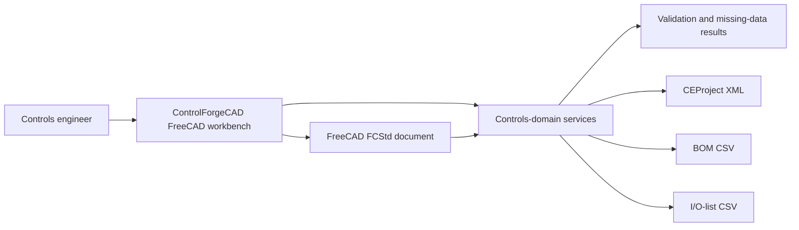
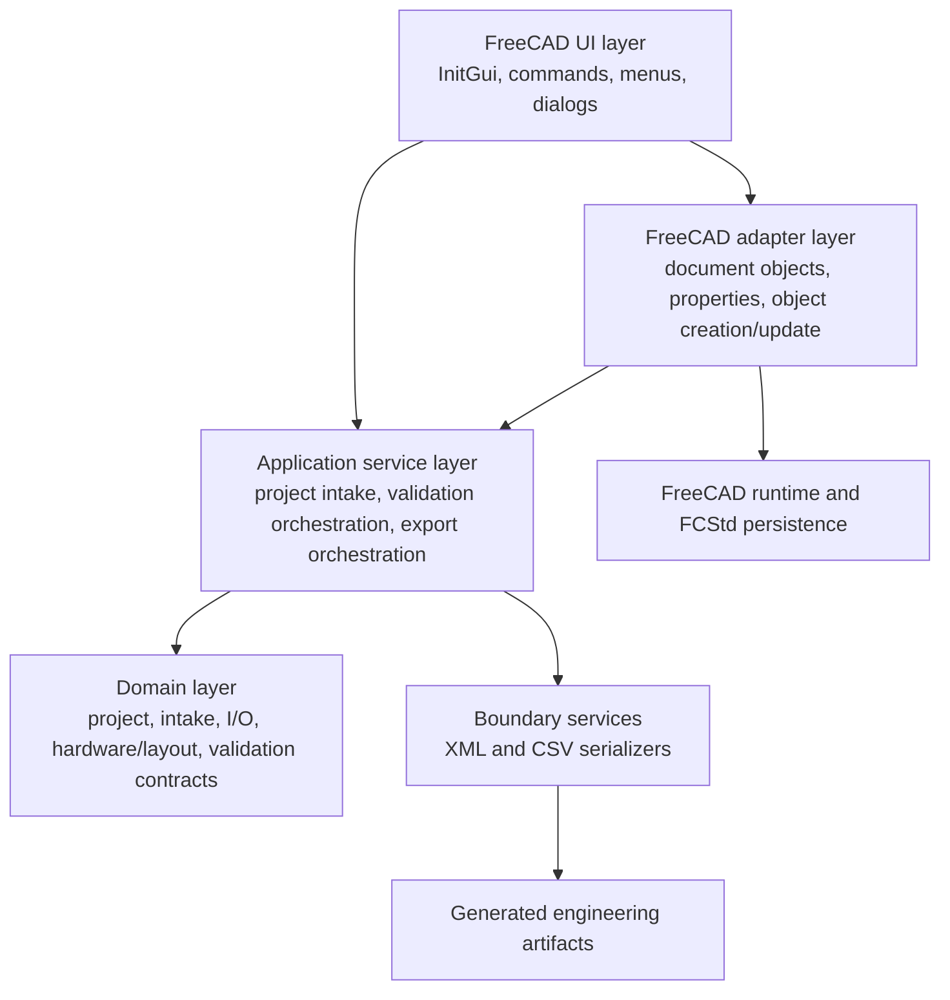
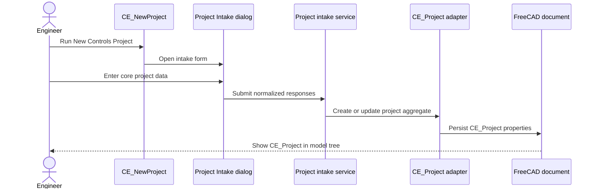
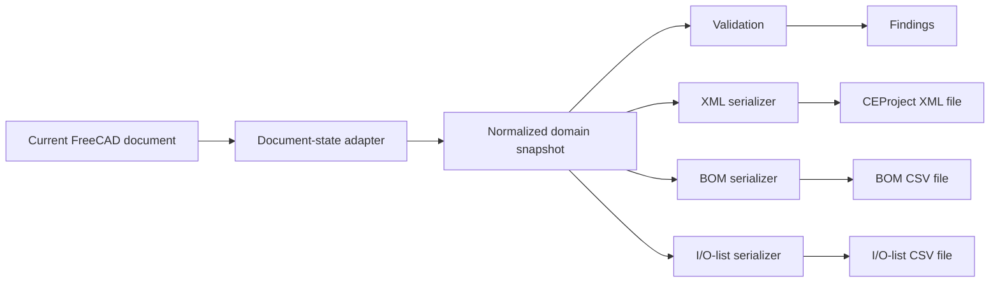

# integraCAD Open Architecture

## 1. Purpose and scope

This document is the architectural source of truth for **integraCAD Open**. The project provides controls-engineering data, validation, layout, and documentation workflows. **ControlForgeCAD** is the current FreeCAD workbench implementation contained in `ControlForgeCAD/`.

The architecture is intentionally layered so controls-domain behavior can be tested independently of the FreeCAD GUI and extended without embedding business rules in toolbar commands or dialogs.

## 2. System context

integraCAD Open currently supports an engineer who needs to:

1. collect initial controls-project information;
2. persist that information in a FreeCAD document;
3. identify missing or incomplete engineering data;
4. create starter control-panel layout objects;
5. validate project and layout metadata; and
6. export starter CEProject XML, BOM CSV, and I/O-list CSV artifacts.



## 3. Project identity and naming

- **integraCAD Open** is the overall open-source controls-engineering CAD project.
- **ControlForgeCAD** is the current FreeCAD workbench and integration module.
- `CE_Project` is the principal FreeCAD document object representing project-level controls data.
- Commands use the `CE_` prefix to identify controls-engineering workbench actions.

Historical references to IntegraCAB should be treated as legacy naming unless they refer to an existing output filename or compatibility behavior. New project-facing documentation and design work should use **integraCAD Open**.

## 4. Architectural principles

### 4.1 FreeCAD is an adapter, not the domain model

FreeCAD commands, dialogs, and document properties adapt user actions and persisted `.FCStd` state into controls-domain inputs. Domain rules should remain callable from pure Python wherever practical.

### 4.2 One authoritative project state

The active FreeCAD document and its `CE_Project` properties are the authoritative interactive project state. Export and validation services must read current object values rather than stale dialog values or module-level caches.

### 4.3 Deterministic outputs

Given the same project state, XML, BOM, I/O-list, validation, and missing-data outputs should be stable in field selection, ordering, and serialization.

### 4.4 Explicit implementation status

Documentation distinguishes:

- **Implemented** — present and usable in the current workbench;
- **Partial** — implemented as a starter contract or placeholder model;
- **Planned** — architectural direction without a complete implementation.

### 4.5 Dependency direction

Higher-level user-interface code may depend on application and domain services. Domain modules must not depend on GUI widgets. Exporters may depend on domain contracts but should not own project-state mutation.

### 4.6 Working-first and deferred ROS boundary

The near-term product is a usable electrical/PLC engineering workflow. Digital
twin execution is deliberately deferred. ROS/ROS 2 is the selected future
runtime integration boundary, but ROS packages must not become dependencies of
the core domain, FreeCAD document model, or ordinary exports. A versioned adapter
will later map stable CEProject identities to ROS interfaces and simulation state.

## 5. Layered architecture



### 5.1 FreeCAD UI layer

**Responsibilities**

- register the Controls / Automation workbench;
- expose commands through menus and toolbars;
- open the Project Intake dialog;
- obtain the active FreeCAD document and selected objects;
- present validation, missing-data, and export results;
- provide safe behavior when optional GUI facilities are unavailable.

**Implemented commands**

- `CE_NewProject`
- `CE_AddIOSignal`
- `CE_AllocatePLCIO`
- `CE_AddConnection`
- `CE_AddElectricalPath`
- `CE_EditElectricalPath`
- `CE_CreatePanel`
- `CE_ValidateProject`
- `CE_PreviewMissingData`
- `CE_ExportBOM`
- `CE_ExportCEProjectXML`
- `CE_ExportIOList`
- `CE_ExportMissingDataCSV`
- `CE_ExportConnectionSchedule`
- `CE_ExportElectricalSchedules`

**Boundary rule:** command activation methods should coordinate work, not define validation rules, output schemas, or equipment-selection logic.

### 5.2 FreeCAD adapter and document-object layer

**Responsibilities**

- create or locate the `CE_Project` document object;
- define editable project and intake properties;
- synchronize FreeCAD properties with backend input contracts;
- preserve properties through `.FCStd` save and reload;
- create starter physical-layout objects with BOM-relevant metadata;
- translate FreeCAD object state into domain records.

The `CE_Project` object currently exposes project and intake fields such as project name, customer, site/location, deliverables, PLC platform, voltage, phase count, enclosure rating, and sensor count.

Starter layout objects currently include:

- panel/backplate;
- DIN rail;
- wire duct;
- terminal strip;
- PLC rack; and
- PLC module.

These layout objects are **partial engineering models**. They establish object identity and metadata contracts but do not yet constitute a complete electrical-panel design or automated placement engine.

PLC allocation is a separate, FreeCAD-independent domain service. It selects
catalog CPU/module capacity, assigns deterministic rack/slot/channel coordinates,
and rejects insufficient capacity or collisions before persistence. A valid
allocation persists its logical I/O mapping on `CE_Project` and the allocation
command materializes a typed `plc.rack` → `plc.module` → `plc.channel` object
tree in the same document transaction. Each allocated channel has a
deterministic typed-signal link, and a path subsequently materialized for that
signal tag reuses the same signal and links back to the channel. Validation
detects missing, unregistered, non-reciprocal, and omitted consuming-path
links. Channel-terminal endpoint authoring remains separate work: the current
path form does not yet select the allocated channel as its terminal owner.

Typed continuous electrical objects now include `ElectricalPathObject`,
`ElectricalTerminalObject`, and `ElectricalWireObject`. The path owns ordered
FreeCAD link lists; wires hold direct links plus redundant immutable endpoint IDs
for validation and interchange. Route points remain ordered millimetre records
and drive the stored calculated length. Materialization preflights the complete
identity set so collisions fail before document mutation begins.
`CE_AddElectricalPath` supplies the first application/UI workflow: it resolves
registered PLC, terminal-strip, and field-device owners; creates a field-device
identity before any terminal is materialized when requested; builds and
validates one fixed three-segment chain outside the FreeCAD API; and commits the
objects inside one FreeCAD transaction. Each form segment may carry ordered
`x,y,z` millimetre coordinates. The domain rejects one-point and non-finite
routes, the FreeCAD wire renders a route polyline when Part is available, and
schedule length uses that route in preference to the fallback specified length.
`HasSpecifiedLength` and `SpecifiedLength` preserve the original estimate even
when a calculated route length also exists. `CE_EditElectricalPath` applies
validated engineering-field changes to one selected path but refuses any change
to path, signal, terminal, or wire identities; a signal-tag edit is propagated
to every path linked to that signal identity. Graphical 3D route selection
remains application-layer work.

The target geometry boundary delegates physical wire and cable routing to the
FreeCAD Cables workbench. ControlForgeCAD remains authoritative for immutable
electrical identities, semantic endpoints, conductor/cable attributes, and
schedule projections, and will link those records to Cables route objects
through an adapter. The current `Part.makePolygon` representation is a
dependency-free fallback, not a competing production routing engine.

### 5.3 Application service layer

**Responsibilities**

- convert current document properties into project-intake inputs;
- orchestrate validation and missing-data evaluation;
- build starter I/O-list records;
- collect BOM-eligible layout objects;
- invoke serializers and select output destinations;
- return structured results suitable for GUI or test use.

Application services define use cases. They should not depend on a particular dialog layout, toolbar arrangement, or FreeCAD selection mechanism.

### 5.4 Domain layer

The domain layer represents controls-engineering concepts independently of presentation and persistence details.

Current or starter contracts cover:

- project identity and site/customer context;
- intake questions, responses, and source records;
- deliverables and platform selections;
- electrical characteristics;
- I/O demand and starter I/O-list records;
- physical-layout and BOM metadata;
- validation findings and missing-data payloads.

Domain validation should return structured findings rather than directly displaying message boxes.

### 5.5 Boundary and serialization services

Boundary services transform domain state into external engineering artifacts.

#### CEProject XML

**Implemented, starter scope.** The XML export serializes the current CEProject/intake state to `~/integracab_ceproject.xml` by default. The export contract should remain versionable and separate from FreeCAD property names so schema evolution does not require GUI redesign.

Planned evolution includes richer contacts, source records, validation findings, hardware references, and standards-aligned interchange mappings.

#### BOM CSV

**Implemented, starter scope.** BOM export collects supported layout objects with assigned manufacturer, part number, description, and related metadata and writes `~/controlforgecad_bom.csv` by default.

The current BOM is not a complete procurement or ERP integration. Future work may add quantity aggregation, vendor normalization, lifecycle status, alternates, pricing interfaces, and manufacturer-catalog adapters.

#### I/O-list CSV

**Implemented, starter scope.** The I/O-list service creates deterministic starter records from explicit user-labeled I/O signals plus current intake data and writes `~/integracab_io_list.csv` by default. For a known catalog PLC, `CE_AllocatePLCIO` assigns and persists deterministic rack, slot, and channel coordinates and materializes persistent PLC occurrence objects in the same transaction. Each resulting channel links to its deterministic typed signal, and later typed paths for that tag reuse and link back to it; endpoint-owner authoring remains incomplete.

Future work may add channel allocation, rack/slot addressing, signal typing, terminal mapping, device associations, safety classification, and vendor-specific import/export formats.

#### Continuous connection-path XML

**Implemented as a standalone boundary contract.** The
`ceproject.connection-path/1.0` vocabulary serializes the ordered path from a PLC
channel terminal through wire segments and cabinet terminal levels to a device
terminal. Its dedicated namespace and XSD cover immutable identities, controlled
roles, sequence positions, conductor metadata, conduit identity, optional
specified length, and 3D route points in millimetres. Import additionally applies
semantic continuity and duplicate-identity validation that XSD alone cannot
express. CEProject imports the path vocabulary explicitly and embeds path
instances without flattening or discarding their namespace. Typed FreeCAD path,
terminal, and wire objects implement the persistence projection. The first
user-facing creation dialog produces this same domain contract; an editor for
existing paths remains pending. Pure-domain whole-project validation now detects
duplicate identities, dangling signal and terminal-owner references, terminal
reuse across different signals, conflicting tags for one signal identity, and
missing wire size, color, or length data. The existing FreeCAD validation command
now invokes this validator through the project-level typed collections.

The `CE_Project` aggregate now provides typed `ElectricalSignals`,
`ElectricalPaths`, and `ElectricalDevices` link collections, each registered in
the canonical fact registry. Path materialization creates or reuses one typed
signal, establishes direct signal/path ownership links, and registers both on the
project. The validation command reconstructs paths from these object links and
feeds them into whole-project semantic validation. Device registration is the
owner-reference bridge: new field devices receive identity and role before
registration, and starter PLC-controller and terminal-strip layout occurrences
register automatically. Terminals can therefore resolve owners through the
project device collection rather than relying on untracked identifiers.

The path-creation service performs form and path validation before creating a
new field-device occurrence. The command provides the outer document transaction
boundary, so rejected input or a later materialization error does not leave a
partial path in a real FreeCAD document.

#### Typed electrical schedules

**Implemented.** `CE_ExportElectricalSchedules` reconstructs typed paths from the
active project and writes a wiring schedule with one row per wire segment plus an
I/O path schedule with one row per signal path. Both include stable identities
and derive endpoint/terminal/length data from the same canonical graph. The
legacy connection-record export remains available during migration.

#### Technical-document registry and library acceptance tests

**Implemented, acquisition scope.** The master equipment catalog links an
XSD-validated technical-document registry keyed to the CAD acquisition request
IDs. Each requested part has one datasheet record whose state distinguishes a
checksummed local file, an exact part pending download, and a family that still
requires exact configuration. The deterministic CSV projections expose those
links for review and provide category-aware acceptance instructions for part
identity, provenance, geometry, mounting, terminal maps, IEC and NFPA/JIC
symbols, ratings, safety evidence, I/O mapping, termination treatment, and
FreeCAD Cables-workbench connectivity. `scripts/build_technical_document_registry.py`
regenerates the XML and both CSV projections from the CAD manifest.

## 6. Principal object contracts

### 6.1 `CE_Project`

`CE_Project` is the interactive project aggregate stored in the FreeCAD document.

**Contract expectations**

- one authoritative project object per controls project document;
- deterministic creation and update behavior;
- editable properties grouped for usable Property View navigation;
- values retained through save/reopen;
- validation and exports read current properties;
- missing values remain distinguishable from valid zero or false values.

### 6.2 Layout objects

Layout objects represent physical or logical panel components in the FreeCAD model tree.

Every project and layout object receives an immutable `CEIdentity` and a
controlled `CERole` when it is created or restored. Business tags, FreeCAD names,
part numbers, and geometry are mutable and must never substitute for identity.
Imported project roots derive a stable identity from their source project ID when
the source does not yet carry a native CE identity; new physical occurrences use
new UUID identities.

**Contract expectations**

- stable object type or role identification;
- human-readable label;
- BOM metadata where applicable;
- parent/containment relationship where supported;
- geometry may be placeholder geometry during starter phases;
- exporters must ignore unsupported objects rather than infer unreliable part data.

### 6.3 Schematic symbol definitions and occurrences

Schematic symbols are standards-profiled catalog definitions plus placed
occurrences, not disconnected drawing blocks. Applicable equipment definitions
must link to explicit IEC and/or NFPA/JIC variants. Symbol pins map to stable
catalog terminal definitions, and a placed symbol occurrence maps to the same
device occurrence referenced by the 3D model, typed electrical graph, BOM, and
schedules. Parent/child symbols—such as a contactor coil and auxiliary contacts
or a PLC module split across drawing sections—share the device occurrence while
retaining distinct symbol-occurrence identities. This symbol-library contract is
planned; the current typed path graph supplies its future smart-net input.

### 6.4 Validation finding

A validation finding should identify:

- rule or field identifier;
- severity or status;
- affected object or data path;
- concise message;
- observed value when useful; and
- remediation guidance when deterministic.

The current missing-data workflow uses paths such as `io.sensorCount` to keep findings traceable to domain fields rather than dialog coordinates.

## 7. Project and data flows

### 7.1 New project flow



### 7.2 Validation and missing-data flow

1. The command resolves the active `CE_Project`.
2. The adapter reads current FreeCAD properties.
3. Application services normalize values into domain inputs.
4. Validation and missing-data rules evaluate those inputs.
5. Structured findings are returned.
6. The GUI presents the result without changing domain semantics.

### 7.3 Starter panel flow

1. `CE_CreatePanel` resolves the active document and project context.
2. Starter layout objects are created using deterministic roles and labels.
3. Objects receive available BOM metadata.
4. Validation can inspect project and layout metadata.
5. BOM export selects supported objects with sufficiently populated fields.

### 7.4 Export flow



Exports should operate on a normalized snapshot so a single export cannot observe internally inconsistent values while the document is being mutated.

## 8. Dependency boundaries

### Allowed dependencies

- GUI commands → adapters and application services
- dialogs → input contracts and application services
- adapters → domain contracts and FreeCAD APIs
- application services → domain logic and serializers
- serializers → domain snapshots and standard-library I/O
- tests → any public contract under test

### Prohibited or discouraged dependencies

- domain modules → FreeCAD GUI or PySide widgets;
- serializers → active-document global state;
- validation rules → message boxes;
- commands → hard-coded schema serialization;
- vendor-specific catalog logic → core project objects without an adapter boundary;
- tests of pure domain behavior → required FreeCAD GUI startup.

Optional integrations must fail safely and must not prevent the base workbench from loading.

## 9. Extension strategy

### 9.1 New command

A new command should contain registration metadata, activation/precondition logic, and orchestration only. Reusable behavior belongs in an application or domain service. GUI behavior requires documented manual validation.

### 9.2 New project field

Adding a project field normally requires coordinated changes to:

1. the domain/intake contract;
2. the `CE_Project` property specification and adapter;
3. normalization and missing-value handling;
4. validation rules;
5. affected serializers;
6. automated tests; and
7. user and architecture documentation.

### 9.3 New export format

A new exporter should accept a normalized domain snapshot, produce deterministic output, avoid mutating the document, and have pure-Python tests. FreeCAD-specific file dialogs should remain in the GUI layer.

### 9.4 Vendor catalog integration

Vendor integrations are **planned**. Each integration should be implemented as an adapter that maps manufacturer data into neutral hardware contracts. Core services should not require Siemens, Rockwell Automation, or another vendor's identifiers to function.

### 9.5 XML schema evolution

Schema changes should be versioned and migration-aware. FreeCAD property names, Python attribute names, and XML element names may map to each other but should not be assumed identical contracts.

## 10. Testing and verification architecture

### Automated validation

Run from the repository root:

```bash
python3 -m pytest
python3 -m compileall ControlForgeCAD
```

Automated tests should prioritize:

- pure domain validation;
- deterministic serialization;
- project property specifications;
- object creation/update behavior;
- command registration and import safety;
- fallback behavior when FreeCAD or GUI modules are unavailable.

### Manual FreeCAD verification

Manual validation remains required for workbench loading, dialogs, toolbar/menu registration, Property View behavior, `.FCStd` persistence, object-tree structure, and generated files initiated from commands. The current manual procedure is maintained in the repository [`README.md`](../README.md).

### Testability rule

A controls-domain behavior that can be expressed without FreeCAD geometry or UI state should be testable without launching FreeCAD.

## 11. Operational considerations

- Development installation uses a symlink or copy into the FreeCAD user `Mod` directory.
- Workbench initialization must remain safe under FreeCAD split execution, where module globals such as `__file__` may not behave like a normal Python import.
- Export paths currently default to files in the user's home directory.
- Generated artifacts should never silently overwrite unrelated files; future file-selection and overwrite policies should be explicit.
- No network service, database, authentication layer, or cloud dependency is currently required.
- Vendor websites and catalogs are not yet runtime dependencies.

## 12. Current implementation status

| Capability | Status | Notes |
|---|---|---|
| FreeCAD workbench registration | Implemented | Controls / Automation workbench and `CE_` commands |
| Project Intake dialog | Implemented | Qt/PySide path with safe fallback |
| Editable `CE_Project` | Implemented | Core project and intake properties persisted in `.FCStd` |
| Missing-data preview | Implemented | Reads current project properties and returns field paths |
| Project validation | Implemented, starter scope | Covers current project and starter layout metadata |
| Starter panel/layout objects | Implemented, partial model | Placeholder geometry and metadata contracts |
| BOM CSV export | Implemented, starter scope | Supported layout objects with assigned part metadata |
| CEProject XML export | Implemented, starter scope | Current project/intake representation |
| I/O-list CSV export | Implemented, starter scope | Deterministic starter records |
| Missing-data CSV export | Implemented, starter scope | One row per required intake fact |
| Neutral equipment catalog | Implemented, starter scope | XML taxonomy, provenance, required-data contracts, and links to specialized catalogs |
| Siemens equipment records | Implemented, imported seed | 104 normalized S7-1200 records, typed properties, source-page locators, checksummed references, and read-only exploration CLI |
| PLC hardware catalog | Implemented, starter scope | XML-backed Siemens S7-1200 planning seed and panel-placeholder metadata |
| Explicit I/O signal registry | Implemented, starter scope | User-labeled signals with starter tags and addresses |
| Manufacturer catalog adapters | Planned | Neutral adapter boundary required |
| Automatic hardware selection | Planned | Must be rules-driven and auditable |
| Full electrical schematic generation | Planned | Not implied by starter layout objects |
| Terminal and wire schedule generation | Planned | Requires richer connection model |
| PLC vendor project-file generation | Planned | Requires vendor-specific adapters and validation |
| Database or collaborative service | Planned/undecided | No current runtime dependency |

## 13. Near-term architectural priorities

1. Expand the CEProject domain and XML contract for contacts, intake provenance, source records, and validation findings.
2. Formalize neutral hardware, device, signal, terminal, and connection identifiers.
3. Separate normalized domain snapshots from FreeCAD property-storage details.
4. Expand deterministic I/O addressing and terminal mapping.
5. Audit imported Siemens records against current manufacturer sources and introduce additional vendor adapters behind neutral interfaces.
6. Add architecture decision records for consequential schema, persistence, and integration choices.

## 14. Documentation governance

### Vendor asset request contract

The backend Siemens asset-request builder accepts explicit CPU and I/O module selections. Unknown selections or missing order numbers raise `ValueError`; callers must present these errors before writing an export. Repeated requests aggregate into quantities after whitespace normalization. The manifest includes `cad_match_status`, currently `unverified`: a catalog source or local checksum does not establish exact-part geometry compatibility. The CSV helper is not yet a FreeCAD export command or an I/O-to-hardware configuration validator.

The two seeded CPUs currently share local CAD references. Exact-part CAD mapping and CPU expansion limits must be verified before automatic cabinet hardware selection can be treated as complete.

Hardware catalog records optionally carry `maxSignalModules`. Absence means unknown. Planning reports over-limit or unknown configurations; asset-request export rejects these when modules are selected. The 1212C limit is two and the 1214C limit is eight. PDF page 23 of the user-supplied Siemens workshop corroborates both family limits; its local path and checksum are registered as `siemens-workshop-expansion`. These checks do not establish power or signal electrical compatibility.

`python -m controls_wb.vendor_assets` exposes explicit selections as stdout CSV, unique part numbers, or a JSON manifest. It completes selection validation before emitting output and exits with status 2 on invalid selections. It performs no file writes, network requests, or FreeCAD mutations.

This document should be updated when a contribution changes a system boundary, component responsibility, dependency direction, object contract, data flow, export contract, extension point, or implementation-status claim.

Material changes must also update [`CHANGELOG.md`](../CHANGELOG.md). Contribution requirements are defined in [`CONTRIBUTING.md`](../CONTRIBUTING.md). Installation and user-facing validation remain in [`README.md`](../README.md).
