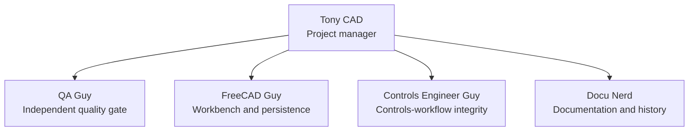
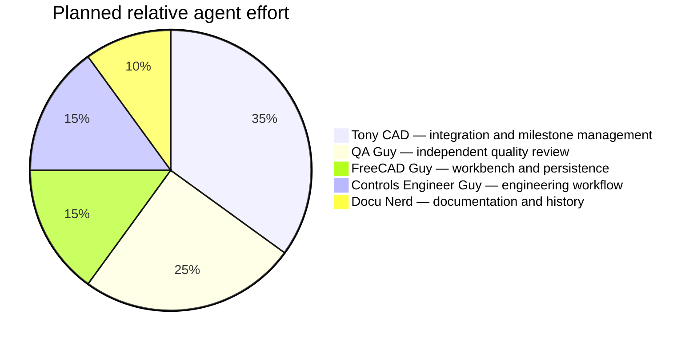

# Project status and agent operating model

This page is the human-readable companion to
[`project-agent-structure.yaml`](project-agent-structure.yaml). The YAML is the
machine-readable source for the agent hierarchy and planned effort allocation;
these percentages are planning weights, **not measured time or utilization**.

## Team structure

## Verified project position

The project provides a pre-alpha but connected workflow: project intake,
catalog-backed PLC I/O allocation, persistent rack/module/channel occurrences,
allocated-channel-owned electrical paths, validation, and deterministic CSV/XML
exports. It is not yet a complete electrical CAD package, vendor PLC IDE, or
engineering-compliance tool.

| Capability | Verified implementation | Remaining boundary |
|---|---|---|
| Project intake | Editable `CE_Project`, intake dialog, source/missing-data tracking, CEProject XML round trip | Broader requirements and external-fact traceability |
| PLC I/O | Catalog selection, deterministic allocation, capacity/collision checks, persistent occurrences | Safe reconciliation after changed counts, slots, or modules |
| PLC-to-field graph | Allocated channel owns the typed signal and PLC endpoint for new paths | Explicit migration/reconciliation of connected paths during allocation changes |
| Wiring and routing | Typed paths, terminals, wires, geometry capture/editing, optional Cables routing, schedules | Cabinet-side power/circuit modeling and richer engineering attributes |
| FreeCAD lifecycle | Identity-aware FeaturePython objects, transaction boundaries, headless regression coverage | Recorded manual allocate/save/reopen/recompute/edit/save/reopen acceptance in FreeCAD |
| Interchange and compliance | Deterministic CEProject/XML/CSV starter boundaries | PLCopen/schematic contracts, vendor adapters, code/safety/protection and commissioning workflows |

## Next milestone

**Safe allocation reconciliation**: changing a PLC allocation must locate every
affected channel-owned path and either migrate it through an explicit validated
operation or stop with deterministic, actionable findings. Connected engineering
data must never be silently deleted or readdressed.

## Evidence and governance

- [Project-management charter](PROJECT_MANAGEMENT_CHARTER.md) — startup,
  source-of-truth, specialist review, and release-gate procedure.
- [QA fault-tree analysis](QA_FAULT_TREE.md) — living failure-mode map and
  future QA evidence backlog.
- [PLC allocation model](../ControlForgeCAD/docs/plc-allocation.md) — allocation
  and occurrence contract.
- [Architecture](ARCHITECTURE.md) — system layers and extension boundaries.
- [Roadmap](../ControlForgeCAD/docs/roadmap.md) and
  [TODO](../ControlForgeCAD/TODO.md) — release direction and remaining scope.

Before a milestone is called complete, Tony CAD records the exact test results,
manual checks still needed, known limitations, and QA Guy’s review outcome.
