# QA fault-tree analysis

## Purpose and scope

This is a living fault-tree analysis (FTA) for integraCAD Open and the
ControlForgeCAD workbench. It helps QA identify *how* a user-visible workflow
can produce an incorrect, incomplete, misleading, or unrecoverable result.
It is a test-design aid—not a record of past incidents, an electrical safety
analysis, or a certification claim.

Use it when planning a milestone, writing regression tests, preparing a manual
FreeCAD acceptance run, or investigating a defect. Add verified reproduction
steps, test coverage, evidence links, and mitigations as they become available;
do not backfill unknown history as though it were observed fact.

## Top event

**A user cannot safely rely on the generated controls-design information.**

```mermaid
flowchart TD
    TOP([Top event: generated design information is unsafe or misleading])
    TOP --> A[Project facts are wrong, missing, or untraceable]
    TOP --> B[PLC allocation disagrees with the typed electrical graph]
    TOP --> C[FreeCAD document state is lost, partially changed, or stale]
    TOP --> D[Export/report misrepresents canonical state]
    TOP --> E[User guide or UI communicates unsupported behavior]
    TOP --> F[Unsupported engineering decision is presented as validated]

    A --> A1[Incorrect intake conversion or XML import/export]
    A --> A2[Missing source, assumption, or status information]
    B --> B1[Capacity, collision, or type-change validation missed]
    B --> B2[Channel move/removal leaves a dependent signal or path]
    B --> B3[Terminal owner or address diverges from allocated channel]
    C --> C1[Transaction partially commits or undo/recompute breaks links]
    C --> C2[Save/reopen loses proxy role, property, or link state]
    D --> D1[Schedule resolves a stale, orphan, or cross-project channel]
    D --> D2[CSV/XML drops identity, ordering, or required trace data]
    E --> E1[Guide claims a manual FreeCAD check that was not performed]
    E --> E2[Command labels or workflow steps no longer match behavior]
    F --> F1[Catalog, sizing, safety, or vendor compatibility claim exceeds evidence]
```

## Failure modes, controls, and evidence gaps

| Branch | Example failure mode | Current preventive/detective control | Evidence still needed or planned |
|---|---|---|---|
| Intake and traceability | Required project fact is transformed incorrectly or loses provenance | Pure-Python intake/XML tests; missing-data matrix; source/status fields | Broader contradictory-fact and external-source coverage |
| PLC allocation | Capacity, collision, duplicate tag, or same-tag type change is accepted | Catalog allocation findings and reconciliation preflight tests | More catalog families and real project data |
| Allocation reconciliation | Moved/removed channel silently deletes or readdresses connected data | Preflight blocks dependent removal; same-type migrations preserve identities; stale cleanup checks references | Manual FreeCAD allocation-change/save-reopen evidence |
| Electrical graph | Signal, channel, PLC terminal owner, designation, or path links diverge | Reciprocal-link and terminal/address validation; regression tests | More terminal/cabinet-power topology variants |
| Document lifecycle | Partial command state, recompute, undo, or FCStd reopen breaks graph | Transaction wrappers, stub tests, import-safe proxies | Recorded desktop allocate → path → save/reopen → recompute → edit → export run |
| Schedule/export | Export resolves an orphan, wrong-project, wrong-signal, or wrong-address channel | Fail-closed schedule checks and multi-project regression tests | CSV consumer interoperability evidence and further export schemas |
| User guidance | Documentation describes a feature or acceptance result that is not delivered | Docu Nerd review; user-guide work-plan; QA release gate | Usability feedback from real controls engineers |
| Engineering boundary | Workbench implies compliance, final design, vendor project generation, or commissioning certainty | Explicit scope/limitation wording in docs and review gates | Qualified engineering review when future scope requires it |

## QA procedure

For a changed workflow, QA Guy should:

1. Identify the affected FTA branches and add focused tests for their failure
   modes before treating the happy path as sufficient.
2. Verify that failure leaves the project/document unchanged, or that any
   migration is explicit, reversible, and fully linked.
3. Check typed-object identity, role, ownership, project registration, and
   export traceability—not just displayed values.
4. Distinguish automated evidence from the manual FreeCAD evidence that is
   still required.
5. Record new observed failure modes with a date, reproduction, severity,
   corrective action, and test/evidence link in a future QA evidence log.

## Current open evidence items

- Execute and record the manual FreeCAD allocation-to-path acceptance workflow
  on a workstation that has FreeCAD installed.
- Expand the fault tree with observed defects and their linked regression tests.
- Add a QA evidence log only after there are actual runs/incidents to record.
- Add formal CI and documentation-build checks when repository automation is
  available.
